<div align="center">


<a href="https://git.io/typing-svg">
  
</a>

<br/><br/>

<!-- Tiny agents: this SVG animates forever on GitHub — no runtime, no actions needed -->


</div>


## About

```typescript
const youcisla = {
  role:      "Systems Analyst @ INSEAD — 3 years",
  builds:    ["production full-stack apps", "legacy platform modernization"],
  stack:     ["Next.js", "TypeScript", "Prisma", "Supabase"],
  since2020: "building automations — AI multiplied it, not replaced it",
  running:   "multiple content channels on ONE n8n pipeline, hands-off",
  method:    "Claude Code as execution layer — I direct agents, they execute",
  coaching:  "people go from 'AI is for homework' → shipping their own MVPs",
  freelance: "rebuilt a client's ticket management system from scratch — new UX, new architecture",
  learning:  "Salesforce (Apex, jsforce) — early days, leveling up, no pretending",
};
```

**The philosophy:** AI is a second brain, not a crutch. I've coached people from near-zero AI experience to shipping functional MVPs of their own — apps, games, webapps — in days, by teaching intent-driven building and ownership of the output. Self-taught approach, proven results.


## What Runs Right Now

| System | Status | Stack |
|---|---|---|
| Production tooling @ INSEAD |  | Next.js · TypeScript · Prisma · Supabase |
| Multi-channel content pipeline |  | n8n · LLM agents · media APIs |
| Ticket management rebuild (client) |  | Full-stack · UX overhaul from scratch |
| Multi-agent side projects |  | Claude Code · DeepSeek · MCP |
| Halal-compliant investing research |  | Automation · finance data |


## Stack

<div align="center">


**In progress — honestly early**


</div>


## Signals

<div align="center">


<br/><br/>

[](https://tokscale.ai/u/youcisla)

<br/>


<br/><br/>

<!-- Contribution snake — generated by .github/workflows/snake.yml (runs daily, free) -->


</div>


## Connect

<div align="center">

<!-- Replace with your real links -->
[](https://linkedin.com/in/youcisla)
[](mailto:chehbouby@gmail.com)
[](https://tokscale.ai/u/youcisla)

<br/>

<sub>Built with intent. Maintained by agents.</sub>

</div>

