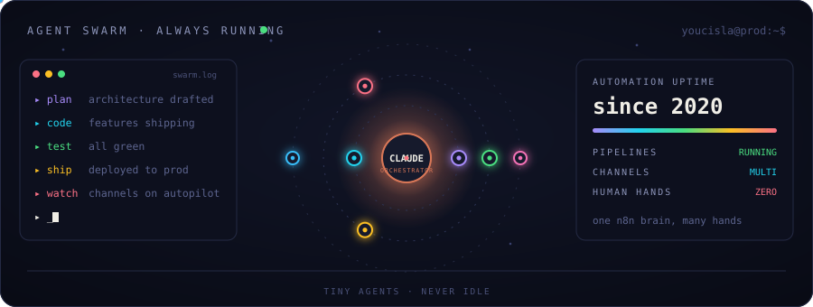

<div align="center">

<!-- THEME-AWARE HEADER: white text on dark theme, deep navy text on light theme -->
<picture>
  <source media="(prefers-color-scheme: dark)" srcset="https://capsule-render.vercel.app/api?type=venom&color=0:A78BFA,50:22D3EE,100:4ADE80&height=220&text=youcisla&fontSize=70&fontColor=ffffff&animation=twinkling&desc=Full-Stack%20Product%20Engineer%20%C2%B7%20AI%20Systems%20in%20Production&descSize=18&descAlignY=68"/>
  <source media="(prefers-color-scheme: light)" srcset="https://capsule-render.vercel.app/api?type=venom&color=0:A78BFA,50:22D3EE,100:4ADE80&height=220&text=youcisla&fontSize=70&fontColor=1B1F3A&animation=twinkling&desc=Full-Stack%20Product%20Engineer%20%C2%B7%20AI%20Systems%20in%20Production&descSize=18&descAlignY=68"/>
  
</picture>

<!-- THEME-AWARE TYPING: bright cyan on dark, deep teal on light -->
<picture>
  <source media="(prefers-color-scheme: dark)" srcset="https://readme-typing-svg.demolab.com?font=Fira+Code&weight=600&size=22&duration=3000&pause=900&color=22D3EE&center=true&vCenter=true&width=760&lines=I+ship+the+product+AND+the+AI+that+powers+it.;Live+products+you+can+open+right+now.;Multi-agent+pipelines%2C+RLS-enforced+privacy%2C+prompt+evals.;Measurement+before+automation."/>
  <source media="(prefers-color-scheme: light)" srcset="https://readme-typing-svg.demolab.com?font=Fira+Code&weight=600&size=22&duration=3000&pause=900&color=0E7490&center=true&vCenter=true&width=760&lines=I+ship+the+product+AND+the+AI+that+powers+it.;Live+products+you+can+open+right+now.;Multi-agent+pipelines%2C+RLS-enforced+privacy%2C+prompt+evals.;Measurement+before+automation."/>
  
</picture>

<br/><br/>

<!-- Tiny agents: self-contained dark card — renders identically on both themes -->


</div>


## About

```typescript
const youcisla = {
  role:      "Systems Analyst @ INSEAD — I build the internal tooling, then go ship my own products",
  focus:     "full-stack product engineering with real AI inside it — not AI bolted on at the end",
  products:  "16 products deployed and publicly reachable — links below, all checked",
  stack:     ["Next.js", "TypeScript", "React 19", "Supabase", "Prisma", "Vite", "Expo"],
  ai:        ["DeepSeek", "Claude Code", "MCP", "GPT-4o", "Groq Whisper", "Ollama", "FAISS", "scikit-learn"],
  data:      ["Spark", "Kafka", "Airflow", "HDFS", "MinIO", "XGBoost"],
  principle: "measurement before automation — a number earns trust, or it doesn't ship",
  method:    "Claude Code as an execution layer. I direct the agents; they execute.",
};
```

**Most "AI projects" are a prompt wrapped in a UI.** I care about the parts that are hard to fake: a multi-agent pipeline whose output is schema-validated and eval-tested · privacy enforced by the **database** rather than the UI · a trading system that reports **its own strategy has no edge** · a synthesis that short-circuits *before* generation when someone is in crisis.

Two tracks, one habit: I ship production software at **INSEAD**, and I build AI products on my own time.

> **On source access:** every product below is live and public — open them right now. Source for client, employer and product work is private; ask and I'll walk you through any of it.


## Open these — live deployments

| | Product | What it is | Source |
|---|---|---|---|
| 🟢 | **[Sentio](https://sentiio.vercel.app)** | Multi-agent AI that reconciles conflict between two people — raw reflections never cross, enforced by row-level security | 🔒 private |
| 🟢 | **[Agent Foundry](https://youcisla-agents.vercel.app)** | MIT runtime for AI coding assistants: 31 original skills, 3 agents, 3 quality gates | **[code](https://github.com/youcisla/Agent-Foundry)** |
| 🟢 | **[Verdictum](https://verdictum.vercel.app)** | The conflict case → verdict product that Sentio grew out of | 🔒 private |
| 🟢 | **[Chapter Zero Studio](https://youtube-book-vids.vercel.app)** | Programmatic video pipeline — JSON in, narrated + captioned + rendered video out | **[code](https://github.com/youcisla/YoutubeVids)** |
| 🟢 | **[INSEAD IT Support Hub](https://it-assistance-jj.vercel.app)** | The multi-campus support platform I rebuilt — Next.js 15, Prisma, 3 campuses | 🔒 private |
| 🟢 | **[DataLake Météo](https://meteo-fr-dt.vercel.app)** | Bronze → Silver → Gold datalake over live + batch weather data | **[code](https://github.com/youcisla/DataLakeHouse)** |
| 🟢 | **[NYC Taxi × Météo](https://nyc-taxi-xi.vercel.app)** | ~7.8 GB of TLC parquet reconciled across legacy and modern schemas | **[code](https://github.com/youcisla/DataLakeNYCtaxi)** |
| 🟢 | **[DataLake · Green Taxi](https://data-lake-module.vercel.app)** | ~29M trips through Spark on a real master, not `local[*]` | **[code](https://github.com/youcisla/DataLakeModule)** |
| 🟢 | **[Kafka Weather Streaming](https://kafka-weather-streaming.vercel.app)** | Open-Meteo → Kafka (KRaft) → Spark Structured Streaming → sliding-window alerts | **[code](https://github.com/youcisla/Kafka)** |
| 🟢 | **[DiaPredict](https://diiapredict.vercel.app)** | Medical diagnostic-aid POC — 5 ML tasks answering one clinical question | 🔒 private |
| 🟢 | **[DataVal](https://data-validator-pi.vercel.app)** | Universal data comparison, with run history | 🔒 private |
| 🟢 | **[DocFlow](https://docflow-steel-seven.vercel.app)** | Intelligent document platform (hackathon build) | 🔒 private |
| 🟢 | **[EcoPulse](https://ecoopulse.vercel.app)** | Flood + drought environmental risk dashboard | 🔒 private |
| 🟢 | **[APOL — UI/UX Revamp](https://apol-sch.vercel.app)** | Full interface redesign of the INSEAD APOL platform | 🔒 private |
| 🟢 | **[APOL Graph](https://apol-graph.vercel.app)** | Codebase knowledge-graph explorer | **[code](https://github.com/youcisla/APOLgraph)** |


## AI systems I built

<details open>
<summary><b>Sentio — a multi-agent pipeline where privacy is a database guarantee</b></summary>

<br/>

**[Live](https://sentiio.vercel.app)** · `900+ commits` · `React 19` · `Supabase` · `DeepSeek` · 🔒 *source private*

Two people in conflict each privately write their side. A server-side pipeline — **advocates → psychological analysis → common ground → jury → judge**, plus private per-person growth notes — synthesises *one* warm, fair, shared output.

The architectural decision everything else bends around: **the synthesis is the only content that ever crosses between participants.** Raw reflections are not hidden in the UI — they are unreadable to the other participant at the **Postgres row-level-security** layer.

- **12 Supabase Deno Edge Functions** orchestrate the pipeline server-side
- **Versioned prompts** + schema-validated model output, with a fixture-based **prompt-eval runner**
- **Crisis detection runs before any generation** and routes the person to safety resources
- **6 locales** (en/fr/es/de/it/ar) with enforced key parity
- Vitest (node + browser) · Playwright E2E · Sentry · deploy watchdog with error-rate alerting

**Verdictum → Sentio.** [Verdictum](https://verdictum.vercel.app) came first — a simpler case → verdict flow. Sentio is the rebuild: same instinct, deeper pipeline, and the privacy guarantee moved out of policy and into the schema.
</details>

<details>
<summary><b>Agent Foundry — a runtime that makes AI coding agents behave</b></summary>

<br/>

**[Live demo](https://youcisla-agents.vercel.app)** · **[Code (MIT)](https://github.com/youcisla/Agent-Foundry)** · `Python 3.10+` · `npm @youcisla/agent-foundry`

Models hallucinate, over-comment, and reach for `npm install` when you asked for a one-line fix. Agent Foundry is the layer that steers them back: **plan → execute → verify**, enforced by skills, agents and gates.

| | |
|---|---|
| **31 skills** | 25 core + 6 optional — *how to think*, not *what to know* |
| **3 agents** | distinct operating modes over the same skill catalog |
| **3 quality gates** | work must clear them before it's considered done |
| **0 external refs** | every skill written from scratch, not re-exported from someone else's pack |

It installs into the config surface of the assistant you already use — Claude Code, Codex, Cursor, Gemini CLI, Qwen, Zed and others — from a single Python package, with a local daemon and no cloud dependency.
</details>

<details>
<summary><b>TradeBot — the project where I measured my own strategy into the ground</b></summary>

<br/>

`Python` · `MetaTrader 5` · `LSTM` · `LightGBM` · 🔒 *source private*

A rebuild from scratch, and the most useful thing I've built.

**The old system:** ~48,000 lines of Python — a nine-agent pipeline, an LSTM, a LightGBM ensemble, GARCH + HMM regime detection, a council of LLM experts and a debate layer. It **could not connect to a broker.** `MT5Connector` inherited an abstract base class without implementing its abstract methods, so every live path raised `TypeError`. The test suite passed the whole time, because every test used a mock.

**Once it could connect, I measured it properly:**

| 3,271 positions · 6 majors | |
|---|---|
| Win rate | **37.9%** |
| Average | **−0.431R** |
| Profit factor | **0.46** |
| Max drawdown | **100%** |

Negative in every symbol, every fold, and on the time-frozen holdout — and still negative under maximally optimistic intrabar fills. Inverting every signal lost *worse*, so it wasn't a sign error. **The strategy had no edge.**

The lesson wasn't "the strategy was bad". It was that **complexity had been built on an unmeasured foundation.** So the rebuild inverts the order: `tradebot.measure` is the only way a number earns trust — as-of slicing on every timeframe (no look-ahead), real per-bar spread and commission on every fill, limit entries required to be touched, true scale-out modelled, and a frozen holdout. The risk envelope is a frozen dataclass read from no environment variable: anything an operator can widen at runtime is a *parameter*, not a *limit*.
</details>

<details>
<summary><b>Chapter Zero Studio — programmatic video, no stock footage, no AI slop</b></summary>

<br/>

**[Live UI preview](https://youtube-book-vids.vercel.app)** · **[Code](https://github.com/youcisla/YoutubeVids)** · **[The channel](https://www.youtube.com/@chapterzer)** · `HyperFrames` · `GSAP` · `ffmpeg` · `Kokoro TTS`

Structured JSON in, finished YouTube video out — one command per chapter:

```
books/{book}/chapter-NN.json
  → Kokoro TTS narration  (am_adam — documentary register)
  → ffmpeg transcode + SRT caption sidecar
  → Sharp + SVG thumbnail (cover + title + chapter badge)
  → HyperFrames + GSAP visual render
  → optional upload via YouTube Data API v3
```

Every frame is a render of HTML I control. No stock footage, no human faces, no unaccountable generative filler — which is the whole point: an AI-assisted pipeline where the output stays legible and reproducible.
</details>


## More AI work

| Project | What it does | Stack | Source |
|---|---|---|---|
| **[UMMG](https://github.com/youcisla/UMMG)** | Unified Model Memory Gateway — one OpenAI-compatible endpoint (:8787) giving every LLM a shared persistent brain. SQLite event log + FAISS vector store + rolling summariser + context-packet builder; adapters for Anthropic / MiniMax / Ollama; SSE streaming | `Python` `FAISS` `SQLite` | **[code](https://github.com/youcisla/UMMG)** |
| **[DiaPredict](https://diiapredict.vercel.app)** | Medical diagnostic aid: **5 ML tasks, one clinical question** — risk stratification by patient profile. RandomForest classification · Ridge + RF regression · KMeans on PCA(3) · IsolationForest anomaly detection · PCA. Serverless-deployed | `scikit-learn` `Vercel` | 🔒 private |
| **DocuBrief** | AI document summarisation with deep PDF processing and **GDPR-compliant anonymisation** before anything reaches a model | `Python` `React` | 🔒 private |
| **[DocFlow](https://docflow-steel-seven.vercel.app)** | Intelligent document platform built during a hackathon | `Next.js` | 🔒 private |
| **[LiveInsta AI](https://github.com/youcisla/liveInsta)** | Live-stream simulator: **Groq Whisper** transcribes your voice in real time, **GPT-4o** generates in-language contextual comments | `Groq` `GPT-4o` | **[code](https://github.com/youcisla/liveInsta)** |
| **[APOL Graph](https://apol-graph.vercel.app)** | Codebase knowledge-graph explorer — turns a repo into a navigable graph of its own structure | `JavaScript` | **[code](https://github.com/youcisla/APOLgraph)** |
| **Sora2 pipeline** | n8n automation that writes its own creative video prompts and renders them through the Sora 2 API | `n8n` `Sora 2` | 🔒 private |
| **ASL-AI** | ASL alphabet recognition — a from-scratch CNN (60×60 grayscale) benchmarked against **VGG16 transfer learning** (224×224 RGB), served through a web UI | `Keras` `Flask` | 🔒 private |
| **Communicate AI** | Browser extension that analyses live conversations and surfaces AI insight | `JavaScript` | 🔒 private |


## Data & platform engineering

Where the AI has to earn its place inside a pipeline rather than sit on top of one.

| Project | What it does | Stack | Source |
|---|---|---|---|
| **[DataLake Météo](https://meteo-fr-dt.vercel.app)** | Persistent **Bronze → Silver → Gold** datalake on HDFS for climate analysis: Météo-France batch archives + Open-Meteo realtime through Kafka & Spark Structured Streaming, Airflow orchestration, XGBoost, an Ollama generation layer and a Streamlit dashboard | `Spark` `Kafka` `Airflow` `HDFS` | **[code](https://github.com/youcisla/DataLakeHouse)** |
| **[NYC Taxi × Météo](https://nyc-taxi-xi.vercel.app)** | ~7.8 GB of TLC parquet in both legacy and modern schemas, schema reconciliation in Spark, medallion layers, business aggregates | `Spark` `Parquet` | **[code](https://github.com/youcisla/DataLakeNYCtaxi)** |
| **[DataLake · Green Taxi](https://data-lake-module.vercel.app)** | ~29M trips (2.8 GB) → raw persisted to object storage *before any transformation*, distributed Spark on a **real master** (no `local[*]`), interactive NYC map dashboard | `Spark` `MinIO` | **[code](https://github.com/youcisla/DataLakeModule)** |
| **[Kafka Weather Streaming](https://kafka-weather-streaming.vercel.app)** | Open-Meteo → Kafka (KRaft, no Zookeeper) → Spark Structured Streaming → sliding-window alert levels, entirely in Docker Compose | `Kafka` `Spark` | **[code](https://github.com/youcisla/Kafka)** |
| **[Big Data platform](https://github.com/youcisla/BigDataProject)** | Medallion lake + warehouse over **5 GB+ of mixed structured/unstructured data** (US stocks/ETF OHLCV, crypto OHLCV + headlines, live CoinGecko API). Spark on a scalable Docker cluster, financial KPIs in PostgreSQL, per-layer monitoring with **Grafana + Prometheus + cAdvisor**, and a multi-encoding dashboard (TradingView charts, chord, ridgeline, radar, word cloud, bubble map) correlating price action against news volume | `Spark` `PostgreSQL` `Grafana` | **[code](https://github.com/youcisla/BigDataProject)** |
| **[EcoPulse](https://ecoopulse.vercel.app)** | Flood + drought environmental risk dashboard on a bronze/silver/gold pipeline | `FastAPI` `React` `Leaflet` | 🔒 private |
| **[RustProject](https://github.com/youcisla/RustProject)** | Air-traffic ETL & reporting for a simulated **Aéroports de Paris** consulting mission, written in Rust with an embedded SQLite store | `Rust` `SQLite` | **[code](https://github.com/youcisla/RustProject)** |


## Product & platform engineering

| Project | What it does | Stack | Source |
|---|---|---|---|
| **[INSEAD IT Support Hub](https://it-assistance-jj.vercel.app)** | The multi-campus support platform I rebuilt end to end. Schema cut **7 tables → 4** with flat enums, all identities unified into one `User` model, badge-first kiosk registration, location awareness across Fontainebleau / Abu Dhabi / Singapore, real-time technician queues, 2-dimension rating. `300+ commits` | `Next.js 15` `Prisma` `MySQL` | 🔒 private |
| **[Verdictum](https://verdictum.vercel.app)** | Case-based conflict resolution — create a case, invite the other side, read the verdict | `Next.js` `Supabase` | 🔒 private |
| **[DataVal](https://data-validator-pi.vercel.app)** | Universal data comparison — validator plus run history | `Next.js` | 🔒 private |
| **[APOL — UI/UX Revamp](https://apol-sch.vercel.app)** | Full interface redesign of the INSEAD APOL platform | `TypeScript` | 🔒 private |
| **FlexRank** | Fitness ranking platform — feed, challenges, leaderboards, social graph | `JavaScript` | 🔒 private |
| **BidVerse** | Cross-platform auction app with real-time bidding, a points economy and GDPR-compliant data handling | `React Native` `Node` | 🔒 private |
| **ParaHub** | Global veterinary parasite directory consolidating peer-reviewed literature, ESCCAP/CAPC/WOAH guidance and lab manuals into a 3-layer evidence model | `TypeScript` | 🔒 private |
| **Streaming analytics** | Real-time analytics across Twitch, Kick and YouTube with no n8n subscription — Node + Supabase | `Node` `Supabase` | 🔒 private |
| **DjangoBot** | Film recommendation engine over multiple data sources (TMDb) with layered recommendation algorithms | `Django` `Python` | 🔒 private |


## Rapid product builds

Idea → working multi-role product in days. I scaffold with an AI app-builder and own the product decisions, data model and role architecture. The route counts below are the evidence of what's actually built:

| Product | What's actually there | Source |
|---|---|---|
| **Scholarship platform** | **46 routes across four role surfaces** — applicant (application form, financial profile, recommenders, Kira interview, payments, award letter, programmes), evaluator, scholarship admin (form designer, evaluation cycles, awards, reminders, reports) and system admin (SOAP monitor). Supabase-backed | 🔒 private |
| **Neighborly Deliveries** | Two-sided delivery marketplace — customer dashboard, **runner** dashboard, pooled orders, live **Leaflet** map view, subscription handling, admin console | 🔒 private |
| **ParaHub implementation** | **15 routes** incl. a full admin suite — parasite directory, bulk imports, moderation queue, user management — over a bilingual (react-i18next) evidence model | 🔒 private |
| **Aylin Aesthetics** | Clinic booking product — service booking, account area, FAQ, admin console with separate admin auth | 🔒 private |
| **Style Bridge Direct** | Barber/stylist marketplace — discovery, booking, barber profiles, in-app messaging | 🔒 private |
| **Alle Epstein Files** | Investigative document explorer — 14 routes over documents, emails, flights, people, a **network graph**, timeline, map, pictures and video, with cross-entity search | 🔒 private |
| **Visage Weave Lab** | Social creation app — create, explore, reels feed, profiles | 🔒 private |
| **Kindred Connect** | Community marketplace with a resources layer | 🔒 private |
| **HalalAlpha** | Halal-compliant investing research surface | 🔒 private |
| **Others** | `team-compass` · `fair-stream-flair` · `echo-of-eloquence` · `trust-chat` — earlier single-surface experiments in the same stack | 🔒 private |

<sub><b>Honest note:</b> these share one stack (`Vite` + `React` + `TypeScript` + `shadcn/ui` + `Supabase`, a few with `Leaflet`) and were scaffolded with an AI app-builder rather than typed from an empty file. What I add is the product thinking, role architecture and data model. I'd rather say that plainly than let you find it in the `package.json`.</sub>


## Stack

<div align="center">


**AI engineering**


**Data platform**


**Also in the work**

**[AI-Assisted Application Development Framework](https://github.com/youcisla/AiFramework)** — an INSEAD governance model for moving an AI prototype to an institutional product, with controls scaling to risk: *idea → classify (data band + integration band) → build safely → test/review → promote → own/monitor/retire*, delivered as a white paper plus technical appendices.

**In progress — honestly early**


</div>


## Signals

<div align="center">

<!-- Fixed dark card backgrounds — consistent on both themes -->


<br/><br/>

[](https://tokscale.ai/u/youcisla)

<br/>

<!-- Activity graph — fixed dark bg, theme-proof -->


<br/><br/>

<!-- THEME-AWARE SNAKE: dark variant on dark theme, light variant on light theme -->
<picture>
  <source media="(prefers-color-scheme: dark)" srcset="https://raw.githubusercontent.com/youcisla/youcisla/output/github-snake-dark.svg"/>
  <source media="(prefers-color-scheme: light)" srcset="https://raw.githubusercontent.com/youcisla/youcisla/output/github-snake.svg"/>
  
</picture>

</div>


## Connect

<div align="center">

[](https://linkedin.com/in/youcisla)
[](mailto:chehbouby@gmail.com)
[](https://tokscale.ai/u/youcisla)

<br/>

<sub>Built with intent. Maintained by agents.</sub>

</div>


